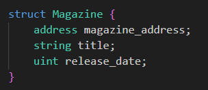
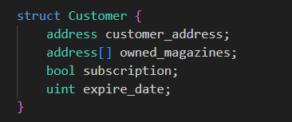
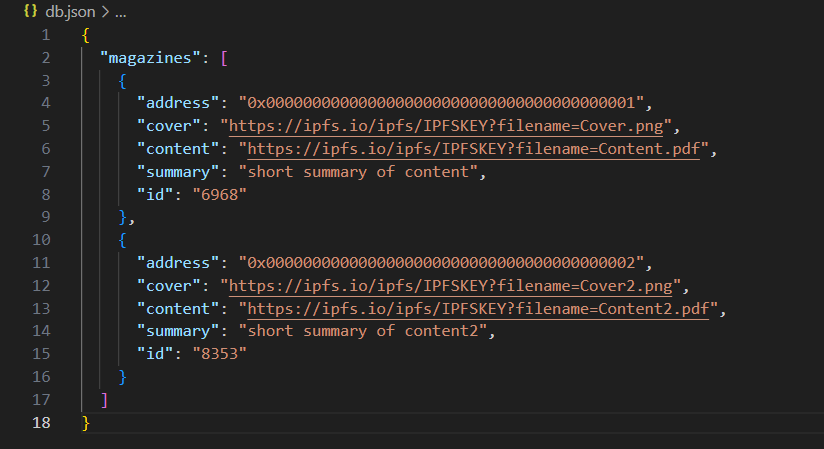

<h1>Science Magazine Store</h1>
Science Magazine Store è una Dapp realizzata per Start2Impact University.

Due smart contract Solidity, MagazineManager e MagazineManagerUtil, hanno lo scopo di gestire l'intero bundle di funzionalità disponibili per utenti ed amministratori mentre il front-end in React rende l'acquisto dei magazine semplice ed intuitivo.

<h2><b>Smart Contracts</b></h2>

<h3><b>MagazineManager</b></h3>

E' lo smart contract principale che regolamenta l'intero processo di creazione e pubblicazione di un magazine, aggiunta di nuovi amministratori, e altre funzionalità che vedremo in dettaglio di seguito.
Iniziamo analizzando le storage variable e le strutture dati.
  

>- **balance**: (built-in) bilancio del contratto 
>- **magazines**: array dei Magazine complessivi 
>- **customers**: array di Customer complessivi 
>- **administrators**: array di indirizzi associati agli amministratori 
>- **owner**: indirizzo proprietario del contratto 
>- **singlePrice**: prezzo di una singola copia 
>- **annualPrice**: prezzo di un abbonamento annuale 
>---

Alla creazione il contratto riempie la variabile owner con il msg.sender e lo aggiunge all'array degli administrators. 
Di seguito esaminiamo le strutture dati utilizzate nel contratto.

<h3>Strutture Dati</h3>

**Magazine**

>- **magazine_address**: rappresenta l'indirizzo del magazine 
>- **title**: rappresenta il titolo del magazine 
>- **release_date**: rappresenta la data di rilascio di ogni magazine. Al momento della creazione del magazine il suo valore è 0, al momento del rilascio viene valorizzato con block.timestamp. 
>---
 

**Customer**

>- **customer_address**: rappresenta l'indirizzo del cliente 
>- **owned_magazines**: rappresenta l'array di magazines posseduti dal cliente 
>- **subscription**: booleano che indica se il cliente ha effettuato l'abbonamento annuale 
>- **release_date**: rappresenta la data di scadenza dell'abbonamento. Valorizzato al momento dell'acquisto dell'abbonamento annuale con il block.timestamp + 365days. 
>---
 

<h3>Funzionalità</h3>
Possiamo suddividere le funzionalità in base al modificatore applicato ad ogni gruppo di funzionalità. 

<h4><u>Nessun modificatore</u></h4>

- **buyMagazine**: funzione che aggiunge all'array owned_magazines del customer (cercato per msg.sender) l'indirizzo del magazine per cui si richiede la funzione di Acquista. Se il msg.sender non è ancora nella lista dei customers, allora verrà prima aggiunto alla lista e poi gli sarà assegnato il magazine richiesto. Nei controlli preliminari viene richiesto che il msg.value sia almeno equivalente al valore singlePrice. All'acquisto, il front-end aggiornerà il ruolo dell'utente da Visitor a Customer e ad operazione completata viene emesso un evento **BuyOrder**.

- **annualSubscribe**: funzione che permette all'utente di ricevere automaticamente una copia del magazine al suo rilascio. (vedi releaseMagazine) Nei controlli preliminari viene richiesto che il msg.value sia almeno equivalente al valore annualPrice. All'acquisto, il front-end aggiornerà il ruolo dell'utente da Visitor a Customer. Ad operazione completata viene emesso un evento **SubscriptionOrder**

- **revokeSubscribe**: funzione che permette all'utente di rimuovere il proprio abbonamento.

- **receive**: funzione che permette al contratto di ricevere ETH. Il front-end permette a tutti gli utenti di effettuare una donazione.

<h4><u>OnlyAdministrators</u></h4>

- **addMagazine**: funzione che permette agli amministratori di aggiungere un nuovo magazine. La sola variabile in input richiesta è il titolo del magazine. Il contratto si occuperà di generare un'indirizzo valido a partire dal testo contenuto nel titolo ed inserirlo nell'array magazines. Ad operazione completata viene emesso un evento **NewMagazine**.

- **releaseMagazine**: funzione che permette di rilasciare un magazine. In input richiede l'indirizzo del magazine ma al front-end vengono richiesti l'URL della copertina del magazine, l'URL della copia del magazine (entrambi URL di risorse hostate su IPFS) e una descrizione del numero per poter rilasciare il numero. La funzione si occupa anche di aggiungere, per ogni customer con l'abbonamento annuale, l'address del magazine rilasciato nell'array owned_magazine. Infine ad ogni rilascio (viene supposto il rilascio di una copia al mese) avviene un processo di pulizia dell'array customers effettuando un check sull'expire_date. Ad operazione di rilascio completata viene emesso un evento **ReleaseMagazine**.

<h4><u>OnlyOwner</u></h4> 

- **addAdmin**: funzione che permette all'owner del contratto di aggiungere un indirizzo all'array administrators garantendogli l'autorizzazione ad utilizzare tutte le funzioni con modificatore onlyAdministrators. Inoltre ogni amministratore ha la possibilità di essere ricompensato (vedi splitProfit).

- **withdraw**: funzione che permette all'owner di prelevare parzialmente o totalmente il bilancio del contratto.

- **splitProfit**: funzione che permette all'owner di dividere il bilancio del contratto in parti uguali tra gli amministratori. La funzione è pensata per essere utilizzata dopo la funzione **withdraw** per sostenere il lavoro degli amministratori.  

Tutti gli utenti possono in qualunque momento inviare ETH al contratto per mezzo della funzione **receive**. Ad operazione completata viene emesso un evento **Donation**.

<h2><b>Dapp</b></h2>
Applicativo React realizzato in Typescript come user experience dei contratti enucleati sopra. L'applicativo utilizza diverse librerie tra cui le principali:

- **ether.js**: gestione della connessione e dell'interazione con il contratto MagazineManager.
- **firebase (json-server)**: base dati per il salvataggio e la lettura dei dati parziali dei magazines: il database è utilizzabile anche in locale creando un file db.json nella cartella principale del progetto (fuori da src) ed aprendo un secondo terminale in cui sarà necessario eseguire **npm run server**.
- **material ui**: libreria di componenti React 
- **sweetalert**: rendering dei popup.

L'applicativo fornisce un interfaccia grafica al ciclo di vita di ogni magazine. Le 3 fasi standard sono le seguenti:
> 1. L'owner del contratto (o un amministratore) crea un nuovo numero, inserendone soltanto il titolo. Il contratto genera a partire dal testo inserito l'indirizzo del nuovo magazine.

> 2. L'owner del contratto (o un amministratore) rilascia il numero appena inserito, riempiendo il form con due URL e una breve descrizione del numero che verrà esposta agli utenti. I due URL fanno riferimento alle risorse relative alla copertina e al contenuto del numero. Entrambi gli URL vengono forniti da IPFS Desktop al caricamento della risorsa.

> 3. A questo punto gli utenti saranno in grado di vedere il numero rilasciato e decidere se acquistare il singolo numero o effettuare un abbonamento annuale. L'abbonamento annuale garantisce l'accesso a tutti i numeri rilasciati per un anno dalla sottoscrizione.

Viene usato il React Context per gestire i dati relativi alla utenza web3 (indirizzo e bilancio) che effettua il login per mezzo di un provider (Metamask è il provider di default), il suo ruolo nella dapp e il bilancio del contratto. 

<h2><b>Eseguire il progetto in locale</b></h2>

*Installazione*

> **npm install**

*Esecuzione*

> **npm start**

*Esecuzione db locale*

> **npm run server**

Esempio di DB Locale

